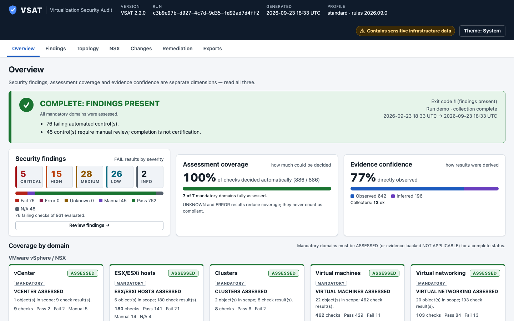

<p align="center">
  
</p>

<h1 align="center">VSAT: Virtualization Security Audit Tool</h1>

<p align="center">
  <strong>Copy it into an isolated environment, run one command, and audit your VMware infrastructure, NSX included.<br>
  You get an evidence-backed assessment with an interactive topology map and practical mitigations.</strong>
</p>

<p align="center">
  <a href="https://nextsecurity.github.io/VSAT/">Website</a> ·
  <a href="https://nextsecurity.github.io/VSAT/demo/report.html">Demo report</a> ·
  <a href="docs/usage.md">Usage</a> ·
  <a href="CHANGELOG.md">Changelog</a> ·
  <a href="SECURITY.md">Security</a>
</p>

> [!WARNING]
> **Status: `2.0.0` has not yet been validated against live labs.**
> - It has **not** been validated against a live vCenter, ESXi or NSX lab. It has only been exercised against synthetic fixtures and the built-in demo.
> - There is **no code-signing certificate**. Verify downloads with the published SHA-256 checksums.
> - The Windows offline package is **assembled on a connected machine** by `build/New-OfflinePackage.ps1`, because we have not confirmed redistribution rights for PowerShell and PowerCLI.
> - CIS control ID mappings are marked **`unverified`** until the licensed benchmark documents have been reviewed.
> - No performance measurements exist yet.
>
> Treat results as decision support that a person reviews. They are not compliance evidence. Please [report problems](https://github.com/NextSecurity/VSAT/issues/new/choose).

<p align="center">
  
  <br><sub>Screenshot of the synthetic demo lab (<code>example.local</code>). No real infrastructure is shown.</sub>
</p>

---

## Download

| Artifact | What it is |
|---|---|
| `vsat.ps1` | A single application file: engine, built-in rules, local UI and report assets. It needs PowerShell 7.4+ and PowerCLI. |
| `VSAT-2.0.0-win-x64-offline.zip` | A portable Windows package: `vsat.ps1`, a portable PowerShell runtime, pinned PowerCLI modules in `./modules`, the `VSAT.cmd` launcher, manifests and notices. **You build it yourself on a connected machine.** See [docs/offline-package.md](docs/offline-package.md). |
| `SHA256SUMS.txt` | Checksums for every release artifact. |

Get releases from the [Releases page](https://github.com/NextSecurity/VSAT/releases). Alpha builds are marked as prereleases.

## One-command start

```powershell
# Offline package (Windows): extract, then
.\VSAT.cmd

# Or, with a compatible PowerShell 7.4+ and PowerCLI already present
.\vsat.ps1                                  # guided browser UI on 127.0.0.1
.\vsat.ps1 -Demo                            # try it with the built-in synthetic lab, no connectivity needed
```

The guided flow has six steps: **launch → authenticate to vCenter/ESXi → NSX step (mandatory) → review detected scope → run → results**. VSAT prompts for credentials securely. Passwords are never accepted on the command line.

```powershell
.\vsat.ps1 -Server vc01.example.local -NsxServer nsx01.example.local
.\vsat.ps1 -Cli                             # terminal-only, same mandatory domains
.\vsat.ps1 -Doctor                          # readiness check only
.\vsat.ps1 -Replay .\assessment.vsat.zip    # reopen/re-evaluate evidence offline, no credentials
```

For all parameters, exit codes and output files, see [docs/usage.md](docs/usage.md).

## Mandatory audit coverage

Coverage is organized **by platform, then by domain**. Each platform VSAT supports gets its own domain table here.

| Platform | Release | Status |
|---|---|---|
| VMware vSphere + NSX | 2.0.0 | Alpha, this release |
| Microsoft Hyper-V | 2.1 | Planned, next release |
| KVM / libvirt | 2.2 | Planned |

### VMware vSphere + NSX

Every full VMware assessment covers all seven domains. A domain VSAT could not read is reported as `INCOMPLETE` or `UNKNOWN`, never as a pass.

| Domain | What is examined (alpha rule pack, still growing) |
|---|---|
| **vCenter** | Build and advisories, SSO/identity and session policy where accessible, roles and inherited permissions, certificates, extensions, services, time, logs, backup configuration |
| **ESXi hosts** | Build vs. advisory ranges, lockdown mode (`HostConfigInfo.lockdownMode`), SSH/shell/DCUI, firewall, services, Secure Boot/TPM where exposed, acceptance level, NTP/DNS, remote logging, advanced settings |
| **Clusters** | HA/DRS, admission control, isolation response, shared failure dependencies |
| **VMs** | Firmware and Secure Boot, vTPM, encryption, devices and passthrough, console settings, snapshots, sensitive advanced settings, VMware Tools |
| **Virtual networking** | Standard and distributed switches, **effective per-portgroup security policy including overrides**, VLANs/trunks, VMkernel separation, uplinks/teaming, LLDP/CDP neighbors, NetFlow/mirroring destinations |
| **NSX** (mandatory) | Manager/cluster, fabric and transport nodes, segments, Tier-0/Tier-1, distributed and gateway firewall order/scope/defaults/exclusions, group membership and realization, logging, backup |
| **Storage & recovery** | vSAN encryption and fault domains, NFS/iSCSI authentication, multipathing, datastore dependencies, snapshot age, backup evidence |

NSX cannot be switched off. If VSAT detects NSX but cannot read it, the whole run reports **`INCOMPLETE: NSX NOT ASSESSED`** and exits with code `2`. You can declare NSX absent with `-NsxDeclaredAbsent`. That declaration is recorded and marked for review. It is not counted as an NSX pass.

The per-control coverage matrix (`docs/coverage.md`) is generated from the rule pack at build time.

Each result is one of `PASS`, `FAIL`, `MANUAL`, `NOT_APPLICABLE`, `UNKNOWN` or `ERROR`. Each domain's coverage is one of `ASSESSED`, `PARTIAL`, `INCOMPLETE`, `UNKNOWN`, `NOT_APPLICABLE` or `REVIEW`.

### Five advanced features

1. **Drift:** `-Baseline <previous .vsat.zip>` shows new, resolved, changed and unassessed items. Evidence that has disappeared is not treated as a resolved finding.
2. **Explainable potential attack paths:** inferred from configuration. Each path lists the firewall rules and prerequisites involved, plus its uncertainty. These paths are not proof of exploitability.
3. **Failure-impact explorer:** pick a host, uplink, datastore or Edge and see which workloads could be affected. This is a configuration model. VSAT injects no failures.
4. **Remediation work packages:** findings grouped by corrective action and team, with impact, maintenance window, rollback and validation steps. VSAT writes guidance and never applies changes.
5. **Collect once, replay, share safely:** `-Replay` re-evaluates saved evidence offline. `-Redact` writes a separate sharing copy that uses consistent pseudonyms.

## Sample report and topology

Open the **[synthetic demo report](https://nextsecurity.github.io/VSAT/demo/report.html)**. It was generated from the built-in demo lab (`example.local`, RFC 5737/1918 addresses). It is the same standalone `report.html` a real run produces, with coverage, findings, the interactive topology, NSX policy views and work packages.

Every run writes these files to the output folder:

| File | Purpose |
|---|---|
| `report.html` | A standalone interactive report that works offline from `file://` |
| `results.json` / `evidence.json` | Machine-readable results and normalized evidence ([data model](docs/architecture/data-model.md)) |
| `findings.csv` / `worklist.csv` | Findings and the remediation worklist, protected against spreadsheet formula injection |
| `collection.log` | Collection log with secrets redacted |
| `manifest.json` | SHA-256 hashes of all outputs |
| `assessment.vsat.zip` | Evidence package for `-Replay` and `-Baseline` |

With `-Redact` you also get `assessment.redacted.vsat.zip` and `report.redacted.html`.

## Supported versions

| Component | Target | Tested |
|---|---|---|
| Runner OS | Windows x64 | **None yet** (fixtures only) |
| PowerShell | 7.4+ (offline package pins 7.6.6 LTS) | Test suite on PowerShell 7.5/7.6 (Windows, Linux CI); **no live assessment yet** |
| PowerCLI | `VMware.VimAutomation.Core` + `.Storage` 13.5.1 (from `VCF.PowerCLI` 9.1.1) | Integration-tested against govmomi vcsim v0.56.0 (simulator); **no live assessment yet** |
| vCenter / ESXi | 8.x and 9.x as modern; 7.x as legacy | **None yet** |
| NSX | Modern NSX (Policy/Manager REST API) | **None yet** |
| Linux / macOS runners | Not supported and not validated | — |
| Hyper-V, KVM/libvirt | Planned for 2.1 and 2.2 | Not available yet |

Versions will be added to the "Tested" column only after live lab verification, with exact builds listed. Older and unrecognized versions are still inventoried, and VSAT marks their coverage as legacy or manual.

## Offline operation

- **No internet needed during an audit, report viewing or replay.** VSAT has no telemetry, CDN, external fonts or cloud accounts.
- The offline package loads its modules **process-locally** from `./modules`. VSAT does not install anything globally, run profile scripts, change execution policy or make permanent configuration changes.
- Advisory data is a dated snapshot. Reports show how old it is. An isolated installation cannot know about advisories published after that snapshot.
- Reports and evidence open without any connection to your infrastructure.

For details, see [docs/offline-package.md](docs/offline-package.md).

## Security model

- **Read-only by design.** vSphere is accessed through read cmdlets. NSX REST calls go through an enforced allowlist of GET requests, and the only POSTs allowed are session create and destroy. VSAT never auto-remediates.
- **Local UI hardening.** The listener binds to loopback only. Each run gets a random token in the URL fragment. VSAT validates Host and Origin, requires a custom-header CSRF check and allows no CORS.
- **Secrets** are kept in memory only and redacted from logs and outputs. VSAT does not use browser storage and never embeds credentials in reports.
- **TLS trust** can be pinned per endpoint with `-TrustedThumbprint "host=SHA256"`. VSAT **never changes the global PowerCLI certificate policy**.
- **Hostile inventory content** is treated as untrusted. Reports use a strict CSP with hashes and safe DOM rendering. CSV formulas are neutralized. ZIP imports have size limits and path validation.

The full threat model and residual risks are in [docs/threat-model.md](docs/threat-model.md). Recommended least privileges are in [docs/privileges.md](docs/privileges.md).

## Limitations

This is an alpha. The main limits:

- Not validated against a live lab. Collectors are built against API documentation and synthetic fixtures.
- CIS mappings are `unverified`. **VSAT is not certified by, endorsed by or affiliated with CIS, VMware or Broadcom**, and a clean run does not mean compliance.
- Guest operating systems, the physical network beyond LLDP/CDP neighbors, and external backup products are not assessed.
- Attack paths and failure impact are inferred from configuration, not observed.
- PowerShell cannot guarantee that secrets are wiped from process memory.
- No code signing yet, and no performance numbers yet.

The complete list is in [docs/limitations.md](docs/limitations.md).

## Roadmap

VSAT is the *Virtualization Security Audit Tool*. It starts with VMware and will grow into a multi-hypervisor datacenter auditor that keeps the same evidence model, coverage rules, report and read-only guarantees.

| Release | Platform | Approach | Status |
|---|---|---|---|
| **2.0.0** | VMware vSphere, vCenter, ESXi + mandatory NSX | PowerCLI reads + NSX REST GET allowlist | **Current alpha** |
| 2.1 | Microsoft Hyper-V (hosts, VMs, virtual switches) | Read-only PowerShell remoting / CIM, `-HyperVServer` | Planned, next release |
| 2.2 | KVM / libvirt | Read-only SSH commands, or an offline collection script whose JSON is imported with `-KvmEvidence`; `-KvmServer` | Planned |

Planned releases are not available yet, and their scope may change. Each one will ship with its own limitations and privilege guidance.

## Documentation and contributing

| Topic | Link |
|---|---|
| Usage and parameters | [docs/usage.md](docs/usage.md) |
| Offline package | [docs/offline-package.md](docs/offline-package.md) |
| Migrating from 1.x | [docs/migration-from-1x.md](docs/migration-from-1x.md) |
| Least privileges | [docs/privileges.md](docs/privileges.md) |
| Threat model | [docs/threat-model.md](docs/threat-model.md) |
| Architecture | [docs/architecture/overview.md](docs/architecture/overview.md), [data model](docs/architecture/data-model.md) |
| Release process | [docs/release.md](docs/release.md) |
| Limitations and FAQ | [docs/limitations.md](docs/limitations.md), [docs/faq.md](docs/faq.md) |

Contributions are welcome, especially lab validation reports that use sanitized evidence. Read [CONTRIBUTING.md](CONTRIBUTING.md) and the [Code of Conduct](CODE_OF_CONDUCT.md) first. Report vulnerabilities privately as described in [SECURITY.md](SECURITY.md). For help, see [SUPPORT.md](SUPPORT.md).

The 1.x script is preserved at [`legacy/vsat-1.x.ps1`](legacy/vsat-1.x.ps1).

## License

[MIT](LICENSE). The VSAT license does not grant any rights to third-party benchmark content. VMware, vSphere, vCenter, ESXi and NSX are trademarks of Broadcom Inc. or its subsidiaries. CIS and CIS Benchmarks are trademarks of the Center for Internet Security. They are used here only to describe compatibility.
