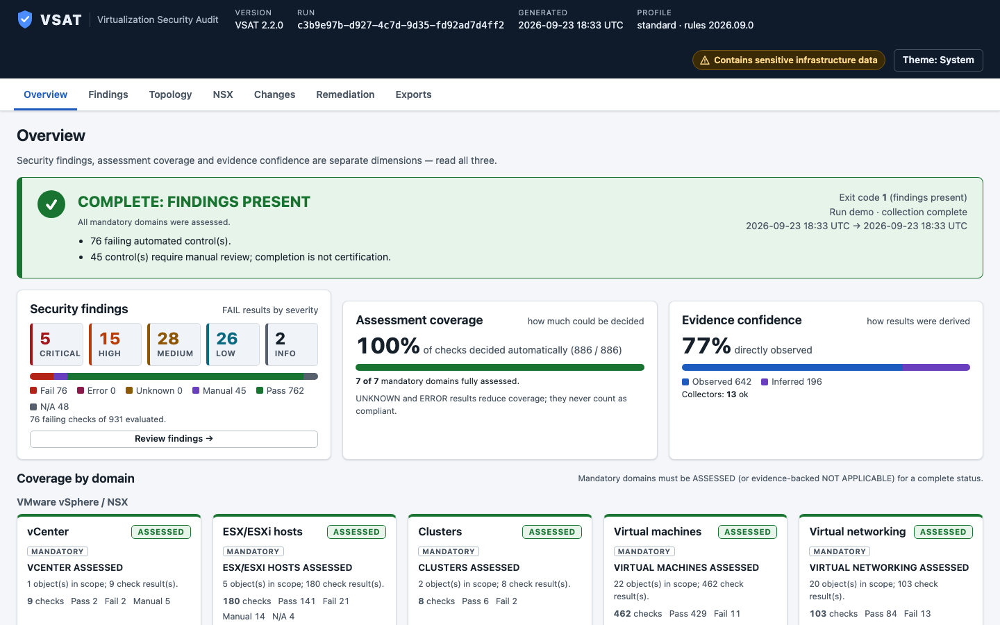

<p align="center">
  
</p>

<h1 align="center">VSAT: Virtualization Security Audit Tool</h1>

<p align="center">
  <strong>Read-only security assessment of the virtualization layer: VMware vSphere with NSX, Microsoft Hyper-V and KVM/libvirt.<br>
  For connected networks and air-gapped IT/OT enclaves. One command, no agents, no internet, no changes to the target.<br>
  You get an evidence-backed report with topology, attack paths, blast radius and fixes ranked by impact.</strong>
</p>

<p align="center">
  <a href="https://nextsecurity.github.io/VSAT/">Website</a> ·
  <a href="https://nextsecurity.github.io/VSAT/demo/report.html">Demo report</a> ·
  <a href="docs/usage.md">Usage</a> ·
  <a href="CHANGELOG.md">Changelog</a> ·
  <a href="SECURITY.md">Security</a>
</p>

<p align="center">
  
  <br><sub>Screenshot of the synthetic demo lab (<code>example.local</code>). No real infrastructure is shown.</sub>
</p>

---

## Who it's for

Security professionals who assess infrastructure that cannot be exposed or changed:

- **Penetration testers, red and blue teams.** Attack paths, blast radius from a compromised account or VM, and a MITRE ATT&CK Navigator layer, all from one read-only run.
- **Security assessors and auditors.** Every finding carries observed and expected values, the evidence it came from, a mitigation, rollback and validation steps. Evidence can be replayed offline and shared as a redacted copy.
- **Defense, government and critical-infrastructure (OT/ICS) teams.** VSAT runs inside isolated enclaves from a portable, hash-verified package. It installs nothing, sends nothing and never writes to the systems it audits.
- **MSSPs and consultancies.** One tool and one report format across VMware, Hyper-V and KVM estates, with baselines to show drift between engagements.

## Download

| Artifact | What it is |
|---|---|
| `vsat.ps1` | **The whole tool in one plain PowerShell file:** engine, rules, local UI and report, all readable text. No binaries, no encoded content. It needs PowerShell 7.4+, plus PowerCLI for VMware targets. |
| `SHA256SUMS.txt` | SHA-256 of every release file. |
| `VSAT-<version>-offline-builder.zip` | Optional, for networks without PowerShell 7 and PowerCLI: sources, dependency lock, SBOM and a builder that produces a portable Windows package on a connected machine. See [docs/offline-package.md](docs/offline-package.md). |

For your security team: [docs/security-review.md](docs/security-review.md) explains what to download, how to verify it, how `vsat.ps1` is laid out and exactly what it does on a system.

Get releases from the [Releases page](https://github.com/NextSecurity/VSAT/releases).

## One-command start

VSAT is a credential-bearing security tool, so these lines never download and run in a single piped step. Each one downloads `vsat.ps1`, verifies it against the published SHA-256 checksum, then runs it, in that order. Re-running the same line later fetches and verifies whatever is newest.

Downloads VSAT, checks it wasn't tampered with, then runs the safe built-in demo (no connectivity needed):

```powershell
# Windows / any PowerShell 7.4+
$u="https://github.com/NextSecurity/VSAT/releases/latest/download";iwr "$u/vsat.ps1" -OutFile vsat.ps1;iwr "$u/SHA256SUMS.txt" -OutFile SHA256SUMS.txt;$h=((gc SHA256SUMS.txt|?{$_ -match '\svsat\.ps1$'}) -split '\s+')[0];if((Get-FileHash vsat.ps1).Hash -ne $h){throw 'checksum mismatch - do not run'};Unblock-File vsat.ps1 -EA 0;./vsat.ps1 -Demo
```

```bash
# Linux / macOS (pwsh installed)
u=https://github.com/NextSecurity/VSAT/releases/latest/download; curl -fsSLO $u/vsat.ps1 -O $u/SHA256SUMS.txt && grep ' vsat.ps1$' SHA256SUMS.txt | (sha256sum -c - 2>/dev/null || shasum -a 256 -c -) && pwsh ./vsat.ps1 -Demo
```

Then, for a real audit: `./vsat.ps1` opens the guided UI on `127.0.0.1`. Credentials are prompted securely and are never typed on the command line.

The `Unblock-File` step clears Windows' Mark-of-the-Web on the download; `-EA 0` makes it a silent no-op on platforms where it does not apply.

### Pin a version (reproducible)

Use these instead of the lines above when you want a specific release rather than always the newest:

```powershell
$v='2.5.0';$u="https://github.com/NextSecurity/VSAT/releases/download/v$v";iwr "$u/vsat.ps1" -OutFile vsat.ps1;iwr "$u/SHA256SUMS.txt" -OutFile SHA256SUMS.txt;$h=((gc SHA256SUMS.txt|?{$_ -match '\svsat\.ps1$'}) -split '\s+')[0];if((Get-FileHash vsat.ps1).Hash -ne $h){throw 'checksum mismatch - do not run'};Unblock-File vsat.ps1 -EA 0;./vsat.ps1 -Demo
```

```bash
v=2.5.0; u=https://github.com/NextSecurity/VSAT/releases/download/v$v; curl -fsSLO $u/vsat.ps1 -O $u/SHA256SUMS.txt && grep ' vsat.ps1$' SHA256SUMS.txt | (sha256sum -c - 2>/dev/null || shasum -a 256 -c -) && pwsh ./vsat.ps1 -Demo
```

VSAT is also published on the PowerShell Gallery as the script `VSAT`: `Install-PSResource VSAT -Repository PSGallery; vsat.ps1 -Demo`. The checksum one-liner above stays the documented default because it works without Gallery access.

### More ways to start

```powershell
# Offline package (Windows): extract, then
.\VSAT.cmd

# Or, with a compatible PowerShell 7.4+ and PowerCLI already present
.\vsat.ps1                                  # guided browser UI on 127.0.0.1
.\vsat.ps1 -Demo                            # try it with the built-in synthetic lab, no connectivity needed
```

The guided flow has six steps: **launch → authenticate to vCenter/ESXi → NSX step (mandatory) → review detected scope → run → results**. VSAT prompts for credentials securely. Passwords are never accepted on the command line.

```powershell
.\vsat.ps1 -Server vc01.example.local -NsxServer nsx01.example.local
.\vsat.ps1 -Cli                             # terminal-only, same mandatory domains
.\vsat.ps1 -Doctor                          # readiness check only
.\vsat.ps1 -Replay .\assessment.vsat.zip    # reopen/re-evaluate evidence offline, no credentials
```

For all parameters, exit codes and output files, see [docs/usage.md](docs/usage.md).

## Mandatory audit coverage

Coverage is organized **by platform, then by domain**. All three platforms can be assessed in one run and one report. Cross-platform lenses add 9 more rules: OT segmentation (6) and ransomware readiness (3), 191 in total.

| Platform | Rules | How VSAT reads it |
|---|---|---|
| VMware vSphere + NSX | 127 | Read-only PowerCLI cmdlets; NSX REST through a GET-only allowlist (`-Server`, `-NsxServer`) |
| Microsoft Hyper-V | 32 | Read-only collector over PowerShell remoting or locally (`-HyperVServer`), or offline (`-ExportCollector hyperv` + `-HyperVEvidence`) |
| KVM / libvirt | 23 | Read-only collector over SSH with key auth and a pinned host key (`-KvmServer`), or offline (`-ExportCollector kvm` + `-KvmEvidence`) |

### VMware vSphere + NSX

Every full VMware assessment covers all seven domains. A domain VSAT could not read is reported as `INCOMPLETE` or `UNKNOWN`, never as a pass.

| Domain | What is examined |
|---|---|
| **vCenter** | Build and advisories, SSO/identity and session policy where accessible, roles and inherited permissions, certificates, extensions, services, time, logs, backup configuration |
| **ESXi hosts** | Build vs. advisory ranges, lockdown mode (`HostConfigInfo.lockdownMode`), SSH/shell/DCUI, firewall, services, Secure Boot/TPM where exposed, acceptance level, NTP/DNS, remote logging, advanced settings |
| **Clusters** | HA/DRS, admission control, isolation response, shared failure dependencies |
| **VMs** | Firmware and Secure Boot, vTPM, encryption, devices and passthrough, console settings, snapshots, sensitive advanced settings, VMware Tools |
| **Virtual networking** | Standard and distributed switches, **effective per-portgroup security policy including overrides**, VLANs/trunks, VMkernel separation, uplinks/teaming, LLDP/CDP neighbors, NetFlow/mirroring destinations |
| **NSX** (mandatory) | Manager/cluster, fabric and transport nodes, segments, Tier-0/Tier-1, distributed and gateway firewall order/scope/defaults/exclusions, group membership and realization, logging, backup |
| **Storage & recovery** | vSAN encryption and fault domains, NFS/iSCSI authentication, multipathing, datastore dependencies, snapshot age, backup evidence |

NSX cannot be switched off. If VSAT detects NSX but cannot read it, the whole run reports **`INCOMPLETE: NSX NOT ASSESSED`** and exits with code `2`. You can declare NSX absent with `-NsxDeclaredAbsent`. That declaration is recorded and marked for review. It is not counted as an NSX pass.

The per-control coverage matrix (`docs/coverage.md`) is generated from the rule pack at build time.

### Microsoft Hyper-V

| Domain | What is examined |
|---|---|
| **Hyper-V hosts** | Update age and OS lifecycle, Secure Boot and TPM, HVCI and Credential Guard, Windows Firewall, SMBv1 and SMB signing, Print Spooler, RDP NLA, live migration authentication and networks, Replica authentication, enhanced session mode, administrator memberships, Server Core |
| **VMs** | Generation 2, Secure Boot and vTPM, encrypted state and migration traffic, MAC spoofing, DHCP and router guard, port mirroring, VLAN trunk mode, Guest Service Interface, checkpoint age, attached media and COM pipes, Discrete Device Assignment |
| **Virtual switches** | External switches shared with the management OS, authorized switch extensions |

### KVM / libvirt

| Domain | What is examined |
|---|---|
| **KVM hosts** | Package update age and OS lifecycle, sVirt (SELinux/AppArmor), unauthenticated libvirt TCP, QEMU running as root, VNC TLS, seccomp, Secure Boot, host firewall, SSH root and password login, libvirt group membership, nested virtualization |
| **Guests** | sVirt labeling, network-exposed consoles, host device passthrough, network serial consoles, USB redirection, nwfilter anti-spoofing, Secure Boot and vTPM, snapshot age |
| **Virtual networks** | Open forward-mode networks |

Each result is one of `PASS`, `FAIL`, `MANUAL`, `NOT_APPLICABLE`, `UNKNOWN` or `ERROR`. Each domain's coverage is one of `ASSESSED`, `PARTIAL`, `INCOMPLETE`, `UNKNOWN`, `NOT_APPLICABLE` or `REVIEW`.

### Analysis features

1. **Blast radius:** pick a compromised account or VM and see what an attacker reaches across every platform, and which fixes break the most paths. Paths are inferred from configuration.
2. **OT segmentation lens:** give scope zones a Purdue level and six `OT-*` rules check that OT and IT workloads do not share hosts, virtual switches, management planes, admin accounts or network paths.
3. **Ransomware readiness:** "could one stolen account encrypt every hypervisor and the backups?" Declare your backup systems and VSAT checks whether an attacker path reaches them, whether they run alongside production, and whether production admins also control them. A card shows how many hypervisors each account controls, worst first.
4. **MITRE ATT&CK mapping:** each attack-path hop and rule is mapped to ATT&CK techniques, and every run writes `attack-layer.json` for the ATT&CK Navigator.
5. **Drift:** `-Baseline <previous .vsat.zip>` shows new, resolved, changed and unassessed items. Evidence that has disappeared is not treated as a resolved finding.
6. **Explainable attack paths:** inferred from configuration. Each path lists the firewall rules and prerequisites involved, plus its uncertainty. These paths are not proof of exploitability.
7. **Failure-impact explorer:** pick a host, uplink, datastore or Edge and see which workloads could be affected. This is a configuration model. VSAT injects no failures.
8. **Remediation work packages:** findings grouped by corrective action and team, with impact, maintenance window, rollback and validation steps. VSAT writes guidance and never applies changes.
9. **Audit integrity:** when the customer runs VSAT for you, the report shows what changed during the engagement (from vCenter events, NSX, Windows event logs and KVM host history), earlier runs by the same account, and a warning when log history is too short. `-CollectOnly` shows no findings, and a receipt code (`VSAT-XXXX-XXXX-XXXX-XXXX`) read aloud at the end of the session proves later that the package you received is the one from that session: `-Replay assessment.vsat.zip -Receipt <code>`.
10. **Collect once, replay, share safely:** `-Replay` re-evaluates saved evidence offline. `-Redact` writes a separate sharing copy that uses consistent pseudonyms.

## Sample report and topology

Open the **[synthetic demo report](https://nextsecurity.github.io/VSAT/demo/report.html)**. It was generated from the built-in demo lab (`example.local`, RFC 5737/1918 addresses). It is the same standalone `report.html` a real run produces, with coverage, findings, the interactive topology, NSX policy views and work packages.

Every run writes these files to the output folder:

| File | Purpose |
|---|---|
| `report.html` | A standalone interactive report that works offline from `file://` |
| `results.json` / `evidence.json` | Machine-readable results and normalized evidence ([data model](docs/architecture/data-model.md)) |
| `findings.csv` / `worklist.csv` | Findings and the remediation worklist, protected against spreadsheet formula injection |
| `changes.csv` | The engagement change timeline: who changed what, when, and which checks it touched |
| `attack-layer.json` | A MITRE ATT&CK Navigator layer (format 4.5) scored by open attack paths and failing controls |
| `collection.log` | Collection log with secrets redacted |
| `manifest.json` | SHA-256 hashes of all outputs |
| `assessment.vsat.zip` | Evidence package for `-Replay` and `-Baseline` |

With `-Redact` you also get `assessment.redacted.vsat.zip` and `report.redacted.html`.

## Supported versions

| Component | Supported |
|---|---|
| Runner OS | Windows x64 |
| PowerShell | 7.4+ (offline package pins 7.6.6 LTS) |
| PowerCLI | `VMware.VimAutomation.Core` + `.Storage` 13.5.1 (from `VCF.PowerCLI` 9.1.1) |
| vCenter / ESXi | 8.x and 9.x as modern; 7.x as legacy |
| NSX | Modern NSX (Policy/Manager REST API) |
| Hyper-V | Windows Server 2016–2025 (lifecycle data for 2012 R2–2025) |
| KVM/libvirt | RHEL/Rocky/Alma 8–10, Ubuntu 22.04–26.04, Debian 12–13 (lifecycle data) |

Older and unrecognized versions are still inventoried, and VSAT marks their coverage as legacy or manual.

## Offline operation

- **No internet needed during an audit, report viewing or replay.** VSAT has no telemetry, CDN, external fonts or cloud accounts.
- The offline package loads its modules **process-locally** from `./modules`. VSAT does not install anything globally, run profile scripts, change execution policy or make permanent configuration changes.
- Advisory data is a dated snapshot. Reports show how old it is. An isolated installation cannot know about advisories published after that snapshot.
- Reports and evidence open without any connection to your infrastructure.

For details, see [docs/offline-package.md](docs/offline-package.md).

## Security model

- **Read-only by design.** vSphere is accessed through read cmdlets. NSX REST calls go through an enforced allowlist of GET requests, and the only POSTs allowed are session create and destroy. VSAT never auto-remediates.
- **Local UI hardening.** The listener binds to loopback only. Each run gets a random token in the URL fragment. VSAT validates Host and Origin, requires a custom-header CSRF check and allows no CORS.
- **Secrets** are kept in memory only and redacted from logs and outputs. VSAT does not use browser storage and never embeds credentials in reports.
- **TLS trust** can be pinned per endpoint with `-TrustedThumbprint "host=SHA256"`. VSAT **never changes the global PowerCLI certificate policy**.
- **Hostile inventory content** is treated as untrusted. Reports use a strict CSP with hashes and safe DOM rendering. CSV formulas are neutralized. ZIP imports have size limits and path validation.

The full threat model and residual risks are in [docs/threat-model.md](docs/threat-model.md). Recommended least privileges are in [docs/privileges.md](docs/privileges.md).

## Limitations

- **VSAT is not certified by, endorsed by or affiliated with CIS, VMware or Broadcom**, and a clean run does not mean compliance.
- Guest operating systems, the physical network beyond LLDP/CDP neighbors, and external backup products are not assessed.
- In OT environments VSAT audits the virtualization layer that hosts OT workloads. Field devices (PLCs, RTUs) and industrial protocols are out of scope.
- Attack paths and failure impact are inferred from configuration, not observed.
- PowerShell cannot guarantee that secrets are wiped from process memory.

The complete list is in [docs/limitations.md](docs/limitations.md).

## Documentation and contributing

| Topic | Link |
|---|---|
| Usage and parameters | [docs/usage.md](docs/usage.md) |
| Security review of `vsat.ps1` | [docs/security-review.md](docs/security-review.md) |
| Offline package | [docs/offline-package.md](docs/offline-package.md) |
| Migrating from 1.x | [docs/migration-from-1x.md](docs/migration-from-1x.md) |
| Least privileges | [docs/privileges.md](docs/privileges.md) |
| Threat model | [docs/threat-model.md](docs/threat-model.md) |
| Architecture | [docs/architecture/overview.md](docs/architecture/overview.md), [data model](docs/architecture/data-model.md) |
| Release process | [docs/release.md](docs/release.md) |
| Limitations and FAQ | [docs/limitations.md](docs/limitations.md), [docs/faq.md](docs/faq.md) |

Contributions are welcome, especially field reports with sanitized evidence and new rules. Read [CONTRIBUTING.md](CONTRIBUTING.md) and the [Code of Conduct](CODE_OF_CONDUCT.md) first. Report vulnerabilities privately as described in [SECURITY.md](SECURITY.md). For help, see [SUPPORT.md](SUPPORT.md).

The 1.x script is preserved at [`legacy/vsat-1.x.ps1`](legacy/vsat-1.x.ps1).

## License

[MIT](LICENSE). The VSAT license does not grant any rights to third-party benchmark content. VMware, vSphere, vCenter, ESXi and NSX are trademarks of Broadcom Inc. or its subsidiaries. CIS and CIS Benchmarks are trademarks of the Center for Internet Security. They are used here only to describe compatibility.
