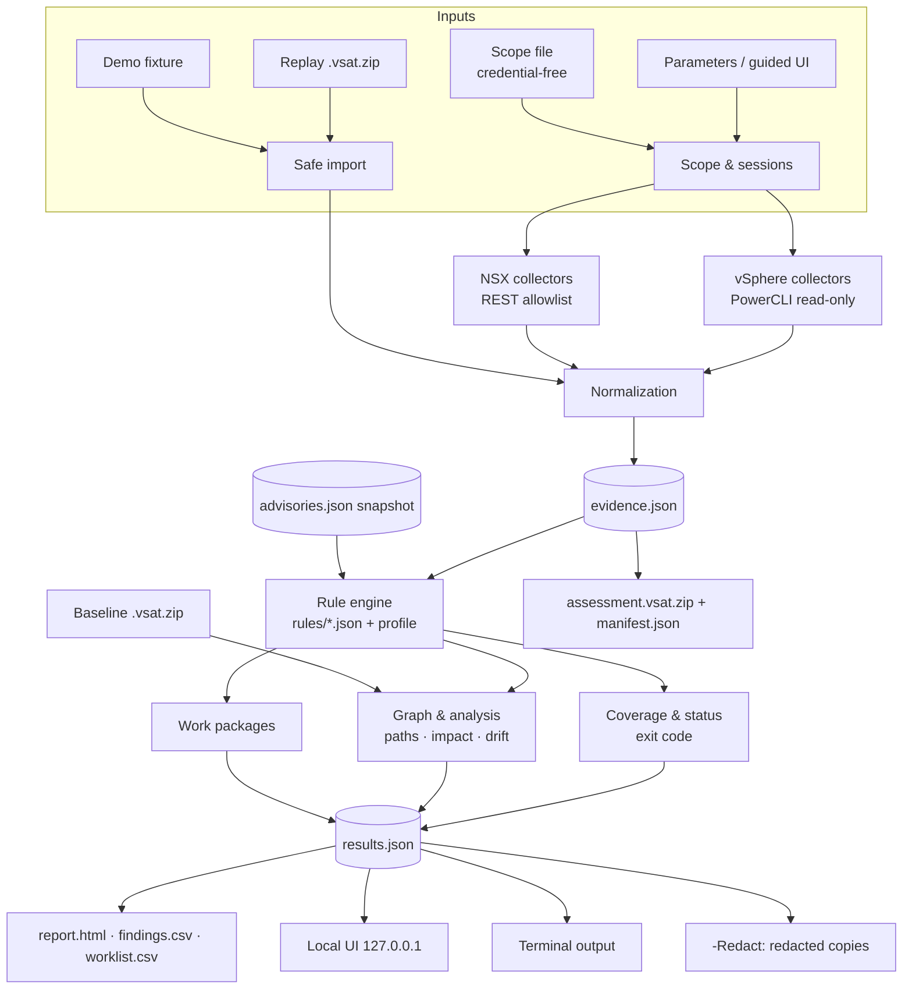

# Architecture overview

VSAT is written in PowerShell. It is developed as modules and **published as one generated file**, `vsat.ps1`, which contains the engine, built-in rules, advisory snapshot, local UI and report assets. For schemas, see [data-model.md](data-model.md).

## Source layout

```text
src/            PowerShell modules (*.ps1), concatenated in order by the build
rules/          rule pack (*.json): applicability, expectations per profile, framework refs, mitigation
data/           advisories.json (dated advisory/build snapshot)
assets/ui/      local guided UI (HTML/CSS/JS, no external resources)
assets/report/  standalone report template, topology renderer
build/          Build-Vsat.ps1 (deterministic single-file build), New-OfflinePackage.ps1 (connected-side builder)
tests/          Pester 5 tests and synthetic fixtures
legacy/         preserved 1.x script and patch list
site/           GitHub Pages landing site
```

## Modules

| Module | Responsibility |
|---|---|
| Bootstrap / Doctor | Parameter handling, runtime and module checks, process-local module path, output folder and permissions, endpoint reachability and TLS trust |
| Scope & sessions | Endpoint registration, scope file parsing (credential-free), credential prompts, per-endpoint thumbprint pinning, connection lifecycle and disconnect |
| vSphere collectors | vCenter, ESXi, cluster, VM, virtual networking and storage evidence through PowerCLI read cmdlets and views |
| NSX collectors | Manager, fabric, segments, gateways, firewall, groups and realization evidence through the REST Policy/Manager API behind a method and path allowlist |
| Normalization | Stable IDs (`<endpointId>:<moref\|nsx-path>`), relationships, timestamps, provenance, per-fact collection status |
| Rule engine | Loads rules, checks applicability, applies profile expectations, evaluates evidence into the six result states, applies exceptions, computes coverage |
| Advisory evaluator | Matches product and build against the dated advisory ranges. Unknown builds stay `UNKNOWN`. |
| Graph & analysis | Topology graph, potential attack paths, privilege paths, chokepoints, failure impact, drift |
| Work packages | Groups findings by corrective action and team |
| Reporting | `results.json`, CSV (formula-neutralized), standalone `report.html` (CSP with hashes), manifest with hashes, evidence ZIP, redacted copies |
| Local UI server | Loopback listener, per-run token, Host/Origin/custom header validation, fixed typed routes |
| CLI | Terminal workflow and progress using the same findings model |
| Replay / import | Safe ZIP import (limits, path validation), schema validation, re-evaluation |

## Data flow



## Key design rules

- **Evidence and conclusions are kept separate.** Collectors never decide PASS or FAIL. Rules never call endpoints. This is what makes replay and drift possible.
- **Missing evidence is never a pass.** Only facts with status `ok` or `absent` can produce `PASS` or `FAIL`.
- **NSX is mandatory.** Its coverage state takes part in the overall status like every other domain.
- **Read-only is enforced by what an operation does, not only by its HTTP method.** Session POSTs are explicitly allowlisted.
- **No runtime downloads.** All UI and report assets are embedded, and the report works from `file://`.

## Build

`build/Build-Vsat.ps1` concatenates `src/*.ps1` in a fixed order and embeds `rules/*.json`, `data/advisories.json` and `assets/` as data. It writes the root `vsat.ps1` **deterministically**: the same inputs produce byte-identical output. It also generates `docs/coverage.md` from the rule pack. See [../release.md](../release.md).
